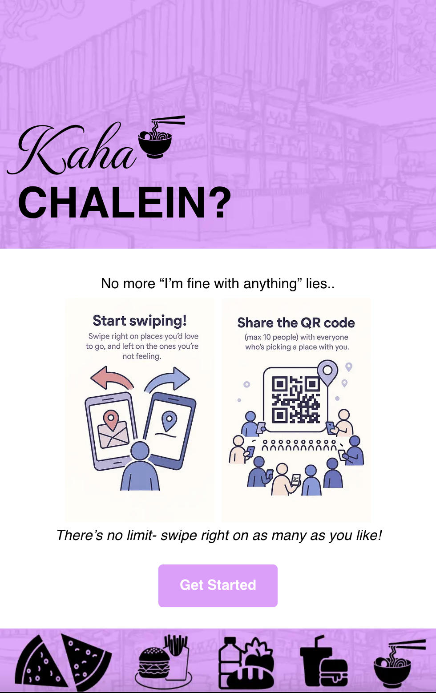
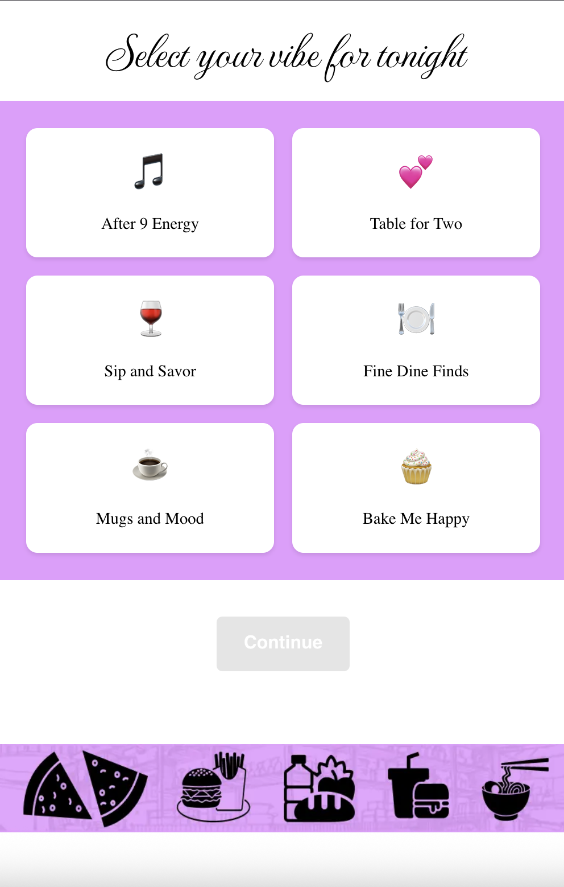
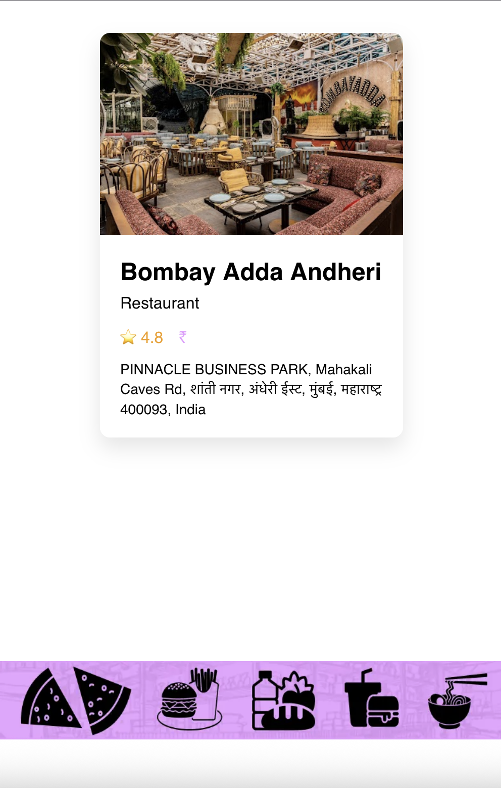

# Kaha Chalein 🍽️ (Dinder)

**A sophisticated real-time group decision-making platform for restaurant selection**

A full-stack mobile-first web application that eliminates the "I'm fine with anything" problem when groups try to decide where to eat. Built with modern web technologies and real-time collaboration features.


## 📸 App Screenshots

<div align="center">
  
  
  
</div>

_Mobile-first design with intuitive swipe gestures and real-time collaboration_

## 🚀 Key Features

### Real-Time Collaboration

- **WebSocket-powered sessions** with automatic reconnection and error handling
- **Live voting progress tracking** with user status updates
- **Session management** with automatic cleanup and timeout handling
- **Multi-user synchronization** supporting up to 10 participants per session

### Advanced Location Services

- **Precise GPS integration** with multiple geocoding fallbacks
- **Google Maps Places API** integration for real restaurant data
- **Intelligent location parsing** with detailed address resolution
- **Dynamic restaurant filtering** based on location and preferences

### Intuitive User Experience

- **Tinder-style card interface** with touch/mouse gesture support
- **QR code session sharing** for seamless group joining
- **Progressive Web App** optimized for mobile devices
- **Responsive design** with custom CSS modules and components

### Smart Matching Algorithm

- **Preference-based scoring** system for group consensus
- **Real-time vote aggregation** with like/dislike tracking
- **Intelligent result calculation** considering all group members
- **Automatic session state management**

## 🏗️ Technical Architecture

### Frontend (Next.js 15 + React 19)

```
src/
├── app/                    # App Router pages
│   ├── cards/             # Voting interface with gesture controls
│   ├── join/              # Session joining with dynamic routing
│   ├── qr-code/           # QR generation and session creation
│   ├── restaurant-type/   # Preference selection interface
│   ├── results/           # Results display with matching algorithm
│   └── user-input/        # User data collection with geolocation
├── components/            # Reusable UI components
│   ├── Buttons/          # Custom button components
│   ├── Header/           # Navigation header
│   ├── Footer/           # App footer
│   └── TopBar/           # Page-specific top bar
└── assets/               # Static assets and images
```

### Backend (Node.js + Express + Socket.IO)

```
server/src/
└── index.js              # Main server with:
                          # - Socket.IO event handling
                          # - Google Maps API integration
                          # - Session management
                          # - Real-time voting system
                          # - Results calculation engine
```

### Core Technologies & APIs

- **Google Maps Places API** - Real restaurant data with photos, ratings, and details
- **Google Geocoding API** - Location services and address resolution
- **Socket.IO** - Real-time bidirectional communication
- **QRCode.react** - Dynamic QR code generation
- **BigDataCloud API** - Enhanced location services with fallback support

## 🛠️ Advanced Implementation Details

### Real-Time Session Management

- Custom session lifecycle with automatic cleanup
- User connection state tracking with reconnection logic
- Vote synchronization across multiple clients
- Session timeout and inactivity handling

### Location Intelligence

- Multi-tier geocoding with fallback strategies
- Precise GPS coordinate handling
- Address parsing with road-level accuracy
- Location-based restaurant filtering

### Voting Algorithm

```javascript
// Sophisticated scoring system
const calculateResults = (session) => {
  const restaurantScores = new Map();
  // Score = likes - dislikes with user weighting
  restaurant.score = votes.likes - votes.dislikes;
  return results.sort((a, b) => b.score - a.score);
};
```

### Performance Optimizations

- Lazy loading with React Suspense
- Optimized bundle splitting with Next.js
- Efficient state management with localStorage
- Connection pooling and error recovery

### Image Loading & Error Handling

- **Smart image fallbacks** with retry logic and exponential backoff
- **Rate limiting protection** for Google Places API image requests
- **Beautiful gradient placeholders** when images fail to load
- **Consistent visual experience** with restaurant-specific fallback designs

## 🚀 Getting Started

### Prerequisites

- Node.js 18+
- Google Maps API key with Places and Geocoding APIs enabled

### Installation & Setup

1. **Clone and install dependencies:**

```bash
git clone https://github.com/yourusername/kaha-chalein.git
cd kaha-chalein
npm install
cd server && npm install
```

2. **Configure environment variables:**

```bash
# Frontend (.env.local)
NEXT_PUBLIC_BACKEND_URL=http://localhost:3001
NEXT_PUBLIC_FRONTEND_URL=http://localhost:3000

# Backend (server/.env)
GOOGLE_MAPS_API_KEY=your_google_maps_api_key
PORT=3001
```

3. **Start development servers:**

```bash
# Terminal 1 - Frontend
npm run dev

# Terminal 2 - Backend
cd server && npm run dev
```

4. **Access the application:**
   - Frontend: `http://localhost:3000`
   - Backend API: `http://localhost:3001`

## 📱 User Journey

1. **Welcome & Onboarding** - Engaging introduction with clear value proposition
2. **User Registration** - Name, mobile, and precise location capture
3. **Preference Selection** - Choose from curated restaurant categories
4. **Session Creation** - Generate QR code for group sharing
5. **Real-time Voting** - Swipe through restaurant cards with live progress
6. **Results & Action** - View matched restaurant with direct booking links

## 🔧 Development Scripts

```bash
npm run dev          # Start development server with Turbopack
npm run build        # Production build with optimizations
npm run start        # Start production server
npm run lint         # ESLint code quality checks
```

---
